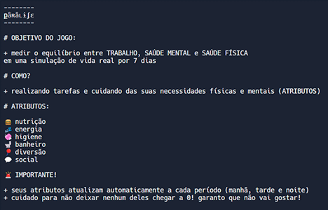
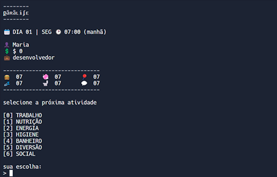
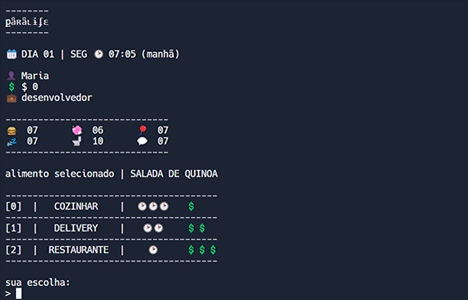
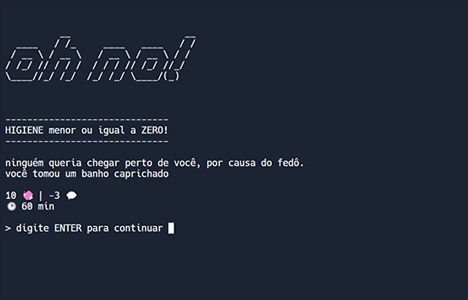

This page is in  English.
Para visualizar essa página em  Português, [clique aqui](./README-ptbr.md).

---

# 🪅 քǟʀǟʟɨʄɛ


քǟʀǟʟɨʄɛ is an interactive fiction game that challenges the player to balance work, mental health, and physical health in a real-life simulation lasting 7 in-game days. To achieve this balance, the player must complete tasks and take care of their physical and mental needs throughout the game.

## 🔗 Demo

- [Replit Demo](https://replit.com/@miaslls/Paralife-Demo?v=1)

## 🟰 Table of Contents

<details open>
<summary>expand / collapse</summary>
&nbsp;

- [General Info](#ℹ️-general-info)
- [Technologies](#-technologies)
- [Screenshots](#%EF%B8%8F-screenshots)
- [Install and Run](#%EF%B8%8F-install-and-run)
- [Authors](#-authors)
- [Acknowledgements](#-acknowledgements)

</details>

## ℹ️ General Info

Proposed exercise:

> _You will create an interactive fiction game that simulates a character's daily routine. You can choose from morning routines, work routines, study routines, epic adventures, scary stories, and more. The idea of the game is for the player to make choices for their character and guide them through the story. Each choice will generate a different consequence for your character. You will be responsible for determining the beginning and end of the story, as well as advancing time with each choice._

## 🧮 Technologies

- Node.js

## 🖼️ Screenshots

<details open>
<summary>expand / collapse</summary>
&nbsp;









</details>

## ⚙️ Install and Run

<details open>
<summary>expand / collapse</summary>
&nbsp;

Clone the project

```bash
> git clone https://github.com/miaslls/Paralife.git
```

Go to the project directory

```bash
> cd Paralife
```

Install dependencies

```bash
> npm install
```

Run the project

```bash
> node src/main.js
```

</details>

## 👩‍💻 Authors

- [@miaslls](https://www.github.com/miaslls)

## 🫶 Acknowledgements

- [@acaua](https://github.com/acaua)
